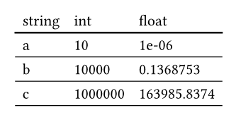

# typ-tables

Inspired by
[great_tables](https://posit-dev.github.io/great-tables/articles/intro.html), a
way to turn DataFrames into Typst tables.

Tables that look like



Created using the following Python script:

```python
import polars as pl
from typ_tables import TypTable

df = pl.DataFrame(
    {
        "string": ["a", "b", "c"],
        "int": [10, 10000, 1000000],
        "float": [0.000001, 0.1368753, 163985.8374],
    }
)

table = TypTable(df)
result = table.to_typst()
```

Which gives you the following typst snippet:

```typ
#table(
  columns: 3,
  column-gutter: (),
  row-gutter: (),
  stroke: none,
  align: (auto, auto, auto),
  inset: 0% + 5pt,
  table.header(table.cell(
  stroke: (bottom: 1.2pt),
  [string],
), table.cell(
  stroke: (bottom: 1.2pt),
  [int],
), table.cell(
  stroke: (bottom: 1.2pt),
  [float],
),),
  table.cell(
  colspan: 1,
  stroke: (bottom: 0.6pt),
  [a],
), table.cell(
  colspan: 1,
  stroke: (bottom: 0.6pt),
  [10],
), table.cell(
  colspan: 1,
  stroke: (bottom: 0.6pt),
  [1e-06],
),
  table.cell(
  colspan: 1,
  stroke: (bottom: 0.6pt),
  [b],
), table.cell(
  colspan: 1,
  stroke: (bottom: 0.6pt),
  [10000],
), table.cell(
  colspan: 1,
  stroke: (bottom: 0.6pt),
  [0.1368753],
),
  table.cell(
  colspan: 1,
  stroke: (bottom: 0.6pt),
  [c],
), table.cell(
  colspan: 1,
  stroke: (bottom: 0.6pt),
  [1000000],
), table.cell(
  colspan: 1,
  stroke: (bottom: 0.6pt),
  [163985.8374],
),
)
```
